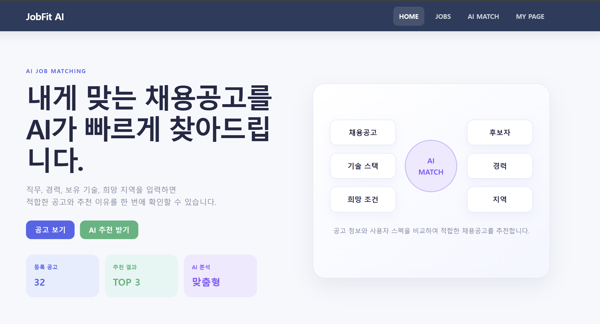
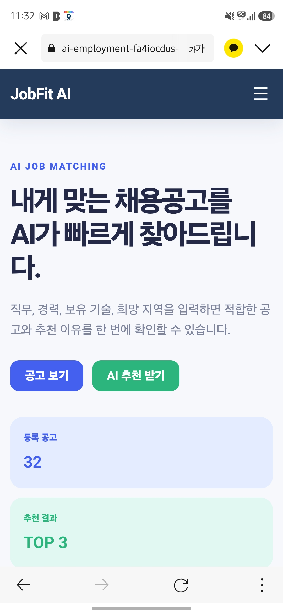
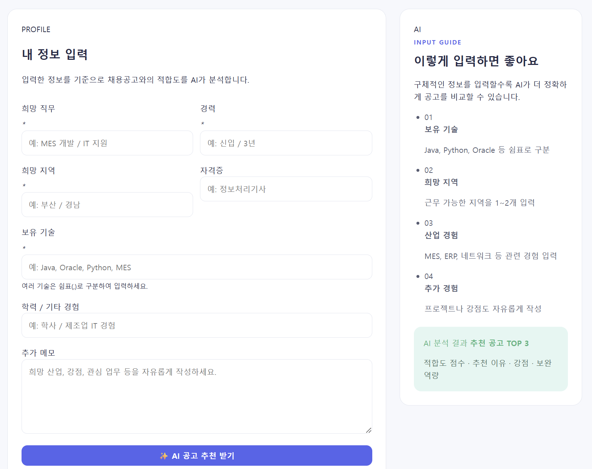

# JobFit AI

AI를 활용하여 사용자의 경력, 보유 기술, 희망 직무 및 지역을 분석하고
적합한 채용공고를 추천해주는 **AI 기반 취업 매칭 웹 서비스**입니다.

사용자가 자신의 정보를 입력하면 AI가 등록된 채용공고를 분석하여
**추천 공고 TOP 3, 적합도, 추천 이유, 강점 및 보완할 역량**을 제공합니다.

---

## 🌐 배포 URL

* **Vercel** : https://ai-employment.vercel.app/index.html
* **GitHub** : https://github.com/birdcross/Ai_employment

---

# 📸 서비스 화면

## 1. 데스크톱 메인 화면

JobFit AI의 메인 화면입니다.
주요 메뉴를 통해 채용공고 조회, AI 추천, 마이페이지 등의 기능으로 이동할 수 있습니다.



---

## 2. 모바일 반응형 화면

모바일 환경에서도 사용할 수 있도록 반응형 UI를 적용했습니다.



---

## 3. AI MATCH 입력 화면

사용자가 희망 직무, 경력, 희망 지역, 보유 기술을 입력하여
AI 채용공고 추천을 요청할 수 있습니다.



---

# 🎯 서비스 목적

취업 또는 이직을 준비하는 사용자가 수많은 채용공고를 직접 비교하는 번거로움을 줄이고,
자신의 경력과 기술에 적합한 채용공고를 빠르게 찾을 수 있도록 돕는 것을 목적으로 합니다.

AI를 이용하여 단순한 채용공고 검색을 넘어 사용자의 조건과 채용공고의 요구사항을 비교하고,
추천 이유와 부족한 역량까지 제공하도록 구현했습니다.

---

# 👤 타겟 사용자

* 취업 준비생
* 이직을 준비하는 직장인
* 자신의 경력과 채용공고 간 적합도를 확인하고 싶은 사용자
* 보유 기술을 기반으로 적절한 직무를 찾고 싶은 사용자

---

# ✨ 주요 기능

### 🔎 채용공고 조회

등록된 채용공고를 조회하고 원하는 공고의 상세 내용을 확인할 수 있습니다.

### 📄 채용공고 상세보기

기업 및 채용공고의 상세 정보를 확인할 수 있습니다.

### 🤖 AI MATCH

사용자의 정보를 AI가 분석하여 가장 적합한 채용공고 TOP 3를 추천합니다.

AI 분석 결과에는 다음 정보가 포함됩니다.

* 채용공고 추천 순위
* 적합도 점수
* 추천 이유
* 사용자의 현재 강점
* 보완하면 좋은 역량

### 👤 MY PAGE

사용자 정보를 확인할 수 있는 마이페이지 화면을 제공합니다.

### 📱 반응형 UI

PC뿐만 아니라 모바일에서도 화면이 정상적으로 표시되도록
CSS Media Query를 이용하여 반응형 UI를 구현했습니다.

---

# 🤖 AI 기능

## 입력 데이터

사용자는 AI MATCH 페이지에서 다음 정보를 입력합니다.

* 희망 직무
* 경력
* 희망 지역
* 보유 기술

예시:

```text
희망 직무 : Android 개발자
경력 : 3년
희망 지역 : 경남
보유 기술 : Java, Android, SQL, Python
```

---

## 출력 데이터

AI는 사용자의 정보와 채용공고 데이터를 비교하여 다음과 같은 결과를 제공합니다.

```text
추천 채용공고 TOP 3

1위 기업
적합도 : 92%

추천 이유
- Android 개발 경험과 요구 기술이 일치함
- Java 및 SQL 활용 경험이 직무와 적합함

현재 강점
- Android / Java 개발 경험
- 데이터베이스 활용 경험

보완하면 좋은 역량
- Kotlin
- 최신 Android Architecture
```

---

# ⚠️ AI 기능 실패 처리

사용자가 서비스를 이용하면서 발생할 수 있는 문제에 대해
다음과 같은 예외 처리를 적용했습니다.

### 필수 입력값 누락

필수 입력값을 입력하지 않은 경우 안내 메시지를 출력합니다.

```text
필수 항목(*)을 모두 입력해주세요.
```

### API 오류

AI API 호출 과정에서 오류가 발생하면 사용자에게 오류 메시지를 표시합니다.

### 응답 지연 / Timeout

AI 응답이 일정 시간 이상 지연될 경우 요청을 중단하고
사용자에게 다시 시도하도록 안내합니다.

현재 Timeout 기준은 약 **25초**입니다.

---

# 🖥️ 페이지 구성

| 페이지        | 설명             |
| ---------- | -------------- |
| HOME       | 서비스 소개 및 메인 화면 |
| JOBS       | 채용공고 목록 조회     |
| JOB DETAIL | 선택한 채용공고 상세 조회 |
| AI MATCH   | AI 기반 채용공고 추천  |
| MY PAGE    | 사용자 정보 화면      |

총 5개의 페이지로 구성되어 있으며
상단 메뉴를 이용하여 페이지 간 이동이 가능합니다.

---

# 🛠 기술 스택

## Frontend

* HTML5
* CSS3
* Vanilla JavaScript
* Fetch API

## Backend

* Python
* FastAPI
* Vercel Serverless Functions

## AI

* OpenAI API

## Deployment

* Vercel

## Version Control

* Git
* GitHub

---

# 📂 프로젝트 구조

```text
Ai_employment/
│
├─ api/
│  └─ index.py
│
├─ css/
│  ├─ common.css
│  ├─ index.css
│  ├─ jobs.css
│  ├─ job-detail.css
│  ├─ match.css
│  └─ mypage.css
│
├─ js/
│  └─ ...
│
├─ images/
│
├─ evidence/
│  ├─ desktop-home.png
│  ├─ mobile.png
│  ├─ ai-input.png
│  ├─ ai-result.png
│  └─ ai-coding.png
│
├─ index.html
├─ jobs.html
├─ job-detail.html
├─ match.html
├─ mypage.html
├─ requirements.txt
├─ SERVICE_PLAN.md
├─ README.md
└─ .gitignore
```

---

# 🔄 서비스 동작 구조

서비스의 AI 기능은 다음 순서로 동작합니다.

```text
사용자 정보 입력
        ↓
JavaScript
        ↓
fetch('/api/recommend')
        ↓
Vercel Serverless Function
        ↓
Python / FastAPI
        ↓
OpenAI API
        ↓
AI 분석 결과
        ↓
JSON 응답
        ↓
JavaScript
        ↓
웹 화면에 추천 결과 출력
```

프론트엔드에서 OpenAI API를 직접 호출하지 않고
Python 백엔드를 통해 호출하도록 구성했습니다.

---

# 🔐 환경 변수

OpenAI API Key는 소스코드에 직접 작성하지 않고
환경 변수로 관리합니다.

환경 변수 이름:

```text
OPENAI_API_KEY
```

Python에서는 다음과 같이 환경 변수를 가져옵니다.

```python
import os

api_key = os.getenv("OPENAI_API_KEY")
```

API Key는 GitHub에 업로드하지 않습니다.

---

# 💻 로컬 실행 방법

## 1. 저장소 Clone

```bash
git clone https://github.com/birdcross/Ai_employment.git
```

프로젝트 폴더로 이동합니다.

```bash
cd Ai_employment
```

---

## 2. Python 패키지 설치

```bash
pip install -r requirements.txt
```

---

## 3. 환경 변수 설정

로컬 개발 환경에서 OpenAI API Key를 설정합니다.

예:

```text
OPENAI_API_KEY=본인의_API_KEY
```

API Key가 포함된 `.env` 파일은 GitHub에 업로드하지 않습니다.

---

## 4. 로컬 서버 실행

Vercel CLI를 사용하는 경우:

```bash
vercel dev
```

실행 후 브라우저에서 로컬 주소로 접속합니다.

---

# 🚀 Vercel 배포 방법

## 1. GitHub 저장소 생성

프로젝트 파일을 GitHub 저장소에 Push합니다.

```bash
git add .
git commit -m "Initial commit"
git push
```

## 2. Vercel 프로젝트 생성

Vercel에서 **New Project**를 선택하고
GitHub의 `Ai_employment` 저장소를 Import합니다.

## 3. 환경 변수 등록

Vercel 프로젝트의 Environment Variables에 다음 값을 추가합니다.

```text
OPENAI_API_KEY
```

## 4. Deploy

환경 변수 설정 후 Deploy를 실행합니다.

GitHub와 Vercel을 연결한 이후에는
GitHub의 `main` 브랜치에 새로운 코드를 Push하면 자동으로 재배포됩니다.

---

# ✅ API 동작 확인

배포 후 다음 API를 이용하여 백엔드 동작 여부를 확인할 수 있습니다.

```text
https://배포주소.vercel.app/api/health
```

정상적인 경우:

```json
{
  "status": "ok"
}
```

AI 추천 기능은 프론트엔드에서 다음 API를 호출합니다.

```text
POST /api/recommend
```

---

# 📱 반응형 테스트

다음 환경에서 화면이 정상적으로 표시되는지 확인했습니다.

* Desktop
* Mobile

브라우저 개발자 도구의 Device Toolbar를 이용하여
모바일 화면에서도 레이아웃이 깨지지 않는지 확인했습니다.

---

# 🧑‍💻 AI 코딩 도구 활용

본 프로젝트에서는 AI 코딩 도구를 활용하여 다음 작업을 수행했습니다.

* HTML 페이지 구조 생성 및 개선
* CSS 스타일 및 반응형 UI 구현
* JavaScript 이벤트 처리
* Fetch API 구현
* Python FastAPI 백엔드 구현
* OpenAI API 연동
* 오류 원인 분석
* Git / GitHub 사용 과정 문제 해결
* Vercel 배포 문제 해결
* README 및 서비스 기획 문서 작성

AI가 생성한 코드를 그대로 사용하는 것에 그치지 않고
오류 발생 시 에러 메시지를 확인하고 원인을 분석하여 수정하는 과정을 함께 진행했습니다.

---

# 📚 과제를 통해 학습한 내용

프로젝트를 진행하면서 다음 내용을 학습했습니다.

### HTML

웹 페이지의 구조와 콘텐츠를 구성하는 역할을 합니다.

### CSS

웹 페이지의 디자인, 레이아웃 및 반응형 화면을 담당합니다.

### JavaScript

사용자의 입력을 처리하고 백엔드 API를 호출하며
응답받은 결과를 웹 화면에 출력하는 역할을 합니다.

### Fetch API

프론트엔드 JavaScript에서 백엔드 API로 데이터를 전달하고
결과를 받아오는 데 사용했습니다.

### Vercel Serverless Functions

별도의 서버를 직접 운영하지 않고도
Vercel 환경에서 Python 백엔드 API를 실행할 수 있도록 사용했습니다.

### 환경 변수

API Key와 같은 중요한 정보를 코드와 분리하여
GitHub에 노출되지 않도록 안전하게 관리하는 방법을 학습했습니다.

### GitHub / Vercel

GitHub를 이용하여 프로젝트 코드의 버전을 관리하고,
Vercel과 GitHub를 연결하여 웹 서비스를 실제 인터넷 환경에 배포했습니다.

---

# 📄 서비스 기획서

상세한 서비스 기획 내용은 다음 문서에서 확인할 수 있습니다.

[서비스 기획서 보기](SERVICE_PLAN.md)

---

# 👨‍💻 개발자

**chunghun lee**

AI 코딩 도구를 활용한 웹 서비스 개발 미션 프로젝트
